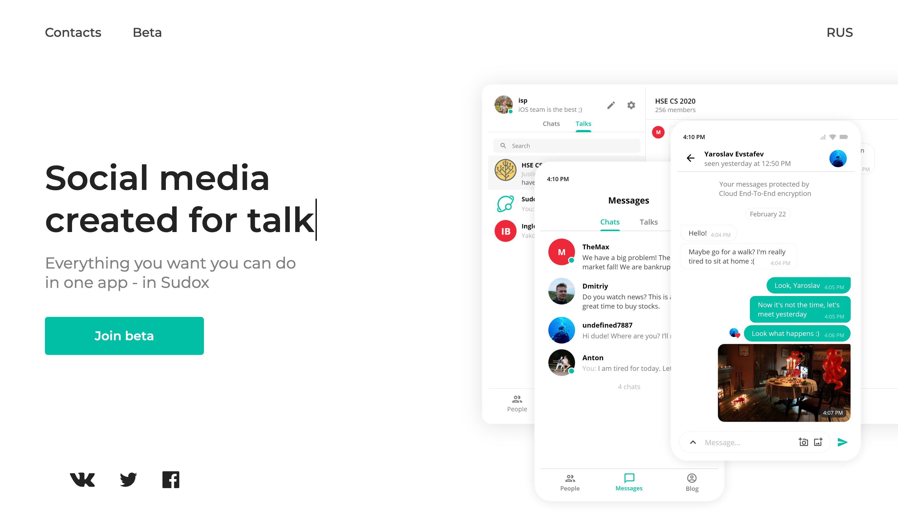

# sudox-frontend

## Project setup
```
$ git clone https://github.com/sudox-team/sudox-frontend.git
$ cd sudox-frontend
$ yarn install
```

### Compilation and hot-reloading for development
```
$ yarn serve
```

### Compilation and code minifying for production
```
$ yarn build
```

## Screenshot

